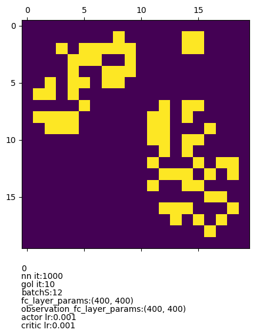
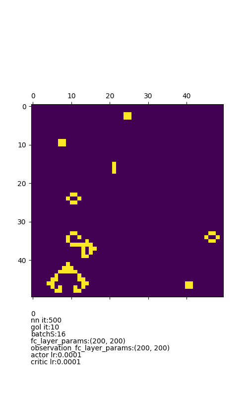
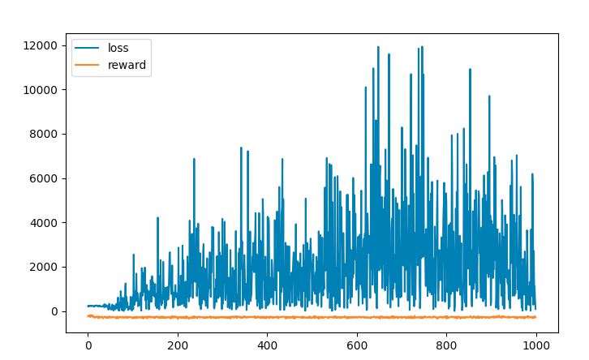

# Ai Powered Game Of Life

The goal of the project is create a neural net which trains on finding most "creative" form of life.
The idea is to iterate over different fitness parameters to find the most interesting form of autonomous life.

Interesting parameters:
- Simple complexity <br>
The simpleComplexity parameter represents the amounts of operations (rules) applied per game.
It represents the complexity for a certain match field.
Maximizing for this parameter probably equals in an absolutely chaotic system since only increasing the complexity is not really helpful to find stable life.

- Entropy <br>
The entropy parameter returns the entropy of a match field.
The calculations for the entropy are taken from [this](https://www-users.cs.york.ac.uk/kazakov/papers/aamas-paper.pdf) paper and can be found at chapter 4 "Entropy Based Fitness of Cellular Automata".
As mentioned in the paper its advantage is that this parameter is great to find "stable" life forms since reduced entropy equals a higher amount of order.

- Probabilistic Complexity <br>
This parameter is from the paper [Algorithmic specified complexity (ASC)](https://robertmarks.org/REPRINTS/2015_AlgorithmicSpecifiedComplexityInTheGameOfLife.pdf) and can be found in section `C. Binary Encoding for Patterns` but is only a component of the postulated *Algorithmic specified complexity (ASC)* but has very interesting characteristics as it defines the  probability of the next pattern.

- Algorithmic Specified Complexity in the Game of Life //todo
This parameter seems to be really promising since it calculates the degree to which an object is meaningful. I made the assumption that the paper would propose a "implementable" formula or method of some kind but the paper bases its calculations on an encoding which is based on visual obervations. The problem with implementing such a solution is that it requires to implement the encoding (or its operators) but the encoding contains operations which are very difficult to detect automatically. As for example the operator "move right" would require an algorithm which is capable of detecting a shift in a complex pattern, this could either be accomplished by a static implementation (which would lack flexibility) or another neural net.
> "Algorithmic specified complexity (ASC) measures the degree to which an object is meaningful [...]"
> -Abstract from the [Paper](https://robertmarks.org/REPRINTS/2015_AlgorithmicSpecifiedComplexityInTheGameOfLife.pdf)


## Network (Parameter) Experiences and Setups (with Test Results)

### Results

Examples that were produced by the network can be viewed at `resultsAnitmations/chaos`, `resultsAnitmations/entropy`, `resultsAnitmations/pComplexity` for the respective fitness function.

### Fitness Parameter: simple Complexity

When optimizing the initial gol matrix to be as complex as possible, the aimed outcome is noise since it technically is the most complex. As mentioned in the "Network Improvement History" the ddpg model has the tendency to optimize the first gol evolution. This can be prevented by adjusting the `earlyEvolutionPenalty`. I've had to experiment quite a bit in order to find a value that works but `2000` seems to be it. When changing the gol evolution count this value has to change proportionally! The same applies on the gol match field dimensions. All the other parameters have no extraordinary effect.

 <br><br>
more can be found at `resultsAnitmations/chaos`.

Test setup paramters:
>  golMatchFieldDims=(20, 20) <br>
>  golMatchFieldNiter=10 <br>
>  earlyEvolutionPenalty=2000 <br>
>  num_iterations=1000 <br>
>  actor_learning_rate=0.001 <br>
>  critic_learning_rate=0.001 <br>
>  initial_collect_steps=100 <br>
>  replay_buffer_capacity=100000 <br>
>  collect_steps_per_iteration=1 <br>
>  batch_size=12 <br>
>  fc_layer_params=(400,400) <br>
>  observation_fc_layer_params=(400, 400)),
> #\ fitnessParameters available: entropy, simpleComplexity, pComplexity <br>
> fitnessParameter="simpleComplexity"


### Fitness Parameter: entropy

As already mentioned in the introduction, the goal of the entropy fitness parameter is to find more "stable" patterns. The entropy defines the level of chaos in a system. As such, the more predictable the next state of the automaton is, the lower the entropy of the pattern. (Dimitar Kazakov, Matthew Sweet. "Evolving the Game of Life").
The earlyEvolutionPenalty is set to 1(and changing it has no great effect) since the entropy values are very small therefor it's worth while playing around with the learning rate (decreasing it) and and the number of iterations. Training on the decrease of entropy is way more computing intensive and I'm not done with "simulating" and testing.

 <br><br>
more can be found at `resultsAnitmations/entropy`.

Test setup paramters:
> golMatchFieldDims=(20, 20), <br>
> golMatchFieldNiter=10, <br>
> earlyEvolutionPenalty=1, <br>
> num_iterations=5000, <br>
> actor_learning_rate=0.001, <br>
> critic_learning_rate=0.001, <br>
> initial_collect_steps=100, <br>
> replay_buffer_capacity=100000, <br>
> collect_steps_per_iteration=1, <br>
> batch_size=12, <br>
> fc_layer_params=(400,400), <br>
> observation_fc_layer_params=(400, 400), <br>
> #\ fitnessParameters available: entropy, simpleComplexity, pComplexity <br>
> fitnessParameter="entropy"

### Fitness Parameter: probabilistic Complexity

The pComplexity defines the probability of the next pattern thus the lower the probability of the next pattern, the more interesting the result. The calculation is relatively computation intensive and the network size has to be chosen carefully since it the possibility of a cpu bandwidth max out which causes the training process to hang.
I expected somewhat same results as with the entropy fitness parameter but that didn't turn out to be the case at all. The only similarity is that there is tendency towards symmetry but instead of reducing the complexity (as the entropy fitness parameter does) it manages to keep up quite complex rich patterns with high symmetry.
The dimensions of the game of life in which this fitness parameter is tested is 50x50 instead of 20x20. This is due to the fact that the effect of this fitness parameter only really works past a certain dimension size.

 <br><br>
more can be found at `resultsAnitmations/pComplexity`.

Test setup paramters:
> golMatchFieldDims=(50, 50), <br>
> golMatchFieldNiter=10, <br>
> earlyEvolutionPenalty=1000, <br>
> num_iterations=500, <br>
> actor_learning_rate=0.0001, <br>
> critic_learning_rate=0.0001, <br>
> initial_collect_steps=100, <br>
> replay_buffer_capacity=100000, <br>
> collect_steps_per_iteration=1, <br>
> batch_size=2, <br>
> fc_layer_params=(200,200), <br>
> observation_fc_layer_params=(200, 200), <br>
> #\ fitnessParameters available: entropy, simpleComplexity, pComplexity <br>
> fitnessParameter="pComplexity"):

## Lib Game Of Life

Path: `libGameOfLife/` <br>

A static C lib which contains the game of life which then can easily be used as training environment for the reinforcement learning. I implemented it in C in order to achieve maximum performance and decrease the nnetworks training time.
The fitness parameter calculations are also implemented here.

## Reinforcement learning

Path: `AiGameOfLife/` <br>

For the reinforcement learning I used a [tf-agent ddpg network](https://www.tensorflow.org/agents/api_docs/python/tf_agents/agents/ddpg/actor_network/ActorNetwork). The DDPG with its GAN like Q-Function is used because its ability to explore huge continuous action spaces. In this case the init state of a game of life.
> The main advantage is that stochastic policies ensure exploration of the state-action space [..]
>
> -- <cite>[Julien Vitay DPG](https://julien-vitay.net/deeprl/DPG.html)</cite>

The model is pretty much implemented as given by the documentation except for the actor net output layer, since the gol has a binary action space, I added a somewhat binary last layer activation function to the actor net. I chose the `tanh`  activation function since it comes close to a somewhat binary output without disrupting the whole model (which a binary output would since 1 and 0 either don't or zero the output which the standard ddpg model is not built for). Instead the model output is rounded to 1/0 before being used as input for the gol.

## libGameOfLife Cython wrapper

Path: `AiGameOfLife/Cython` <br>

In order to train fast, the game of life is not implemented in python but instead in C. The cython wrapper is very easy to use and leverages the c performance increase.
Please don't use any python functions in the training loop (not even print) since this will dramatically alter the gol game duration and with that the networks training time.


## Installation & Test

### Requirements

- tensorflow
- tf_agents
- matplotlib
- cython

### Test

I built the C library on a mac so depending on your platform you may need to rebuild the gol static lib.
```
cd libGameOfLife
bash build.sh
```

The same applies on the Cython project to generate the python module.
```
cd AiGameOfLife/Cython
bash build.sh
```
(the build.sh only work on unix systems, you'll have to manually rebuild the lib on other platforms)

After that the net can be trained, for that run
```
cd AiGameOfLife/
python3 train.py
```
To test the generated game of life matrix run
```
python3 testLatestRes.py  
```
The matrix from the last training process is saved in the `latestRes.npy` file and is read by `testLatestRes.py`


## Network Improvement History

### First test evaluations of the project

The first few runs show several problem areas which need to be investigated.

- model focuses only on first gol evolution 1 (reward calculation over n evolutions per gol game)
  - The actor net action is the initial game of life matrix on which n gol evolution steps are performed. Thus the reward is calculated by adding up the „fitness parameters “ (the factors by which the gol game is rated. For example the simpleComplexity factor) per evolution every single round of gol.
  - A symptom of summing up the „fitness parameters“ for n evolutions of every gol is that the network focuses on the first(or which ever is more efficient) evolution. The result is that the reward plateaus at a certain niveau because the network chooses the shortest path to the highest achievable reward and  does not compromise for the longevity of the factor of interest.
  - A possible solution to this problem is to calculate the “difference sum average” of the values for all evolutions. This would account for a possible focus of the network on one evolution.
- model focuses only on first gol evolution 2
  - After implementing the "difference sum average" the problem that only the first evolution of the gol was maximized on, persisted.
  - As a solution I introduced a balance value(called `earlyEvolutionPenalty`) which increases the "difference sum average" linearly (indirectly proportional to the evolution count). `sum += 1000/i`
  - the result is quite remarkable, *for the first time* the model is able to generate a persistent noise as to be expected when using the "simpleComplexity" as fitness parameter.
  - Noise metrics  <br><br>
  - Noise gif 
- entropy reward implementation
  - The entropy parameter is introduced. The math formula is taken from [this](https://www-users.cs.york.ac.uk/kazakov/papers/aamas-paper.pdf) paper.
  - the reward for the entropy is calculated exactly the same as with the simple complexity
  - only difference is that the sign for the reward is reversed so that the model decreases it(whilst it actually increases it)
  - training seems to be way more computing intensive and parameter sensitive and there is definitely room for exploration
  - Training metrics are not really comprehensive yet thow so there is room to optimize
  - entropy gif 
- pComplexity reward implementation
  - is implemented exactly the same way as the entropy reward
